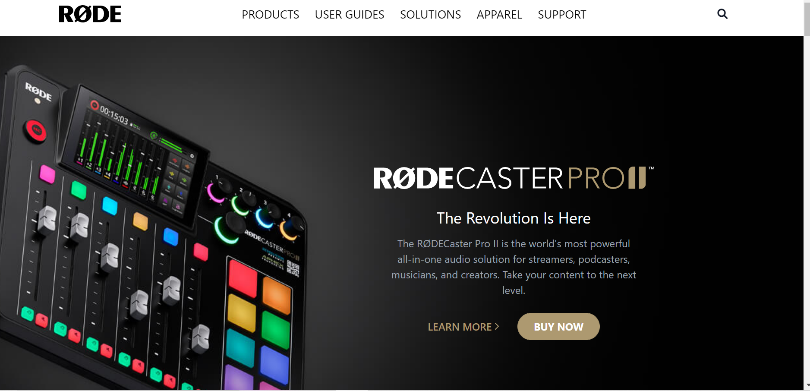

# Road clone

# **Project-** Road clone
>- Skills gained in this project
 >- learned about talwind css
 >- learned about grid and flexbox 
 >- learned about respnsiveness
 >- learned about how to adjust background
 
 ***
 **Time taken to finish to this project**
 
 >-It took me 4 hour to complete this project 

 **Screenshot**
 